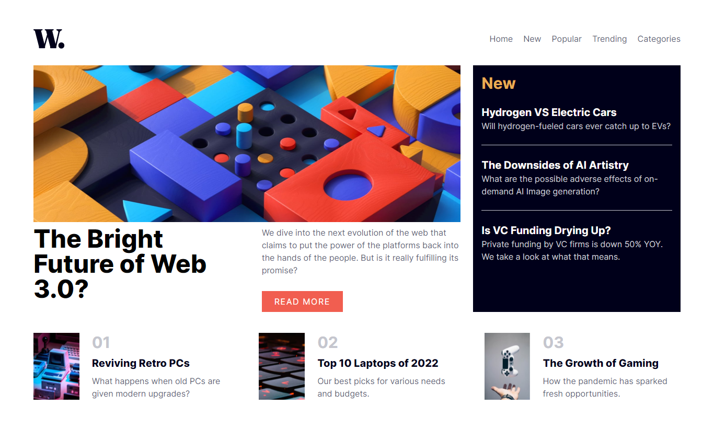

# Frontend Mentor - News homepage solution

This is a solution to the [News homepage challenge on Frontend Mentor](https://www.frontendmentor.io/challenges/news-homepage-H6SWTa1MFl). Frontend Mentor challenges help you improve your coding skills by building realistic projects.

## Table of contents

- [Frontend Mentor - News homepage solution](#frontend-mentor---news-homepage-solution)
  - [Table of contents](#table-of-contents)
  - [Overview](#overview)
    - [The challenge](#the-challenge)
    - [Screenshot](#screenshot)
    - [Links](#links)
  - [My process](#my-process)
    - [Built with](#built-with)
    - [What I learned](#what-i-learned)
    - [Continued development](#continued-development)
    - [Useful resources](#useful-resources)
  - [Author](#author)
  - [Acknowledgments](#acknowledgments)

## Overview

### The challenge

Users should be able to:

- View the optimal layout for the interface depending on their device's screen size
- See hover and focus states for all interactive elements on the page

### Screenshot

### Links

- Solution URL: [Solution URL](https://your-solution-url.com)
- Live Site URL: [Live Site URL](https://news-homepage-chall.netlify.app/)

## My process

### Built with

- Semantic HTML5 markup
- CSS custom properties
- Flexbox
- CSS Grid
- Mobile-first workflow
- [React](https://reactjs.org/) - JS library
- [Tailwind CSS](https://tailwindcss.com/docs/installation) - For Styles

### What I learned

I learned to use the CSS Grid Layout with Tailwind in this project, though it's still a very challenging part of CSS for me, I plan to get better with it in vanilla css and in Tailwind especially.

### Continued development

I will continue to read the docs and improve my tailwind skills. I have really gained interest in tailwind css at this point so that's now a priority.

### Useful resources

- [Official tailwind Docs for sure](https://tailwindcss.com/docs/installation) - This helped me for XYZ reason. I really liked this pattern and will use it going forward.

## Author

- Github - [Multimarix](https://github.com/Multimarix)
- Frontend Mentor - [@Multimarix](https://www.frontendmentor.io/profile/Multimarix)
- LinkedIN - [Don Akhirebhulu](https://www.linkedin.com/in/don-akhirebhulu-675082242/)

## Acknowledgments

Thanks for the project, Frontend Mentor🤞🏾.
